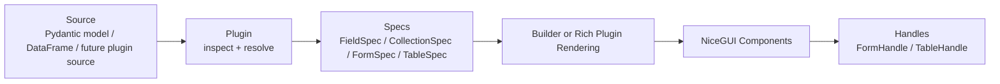
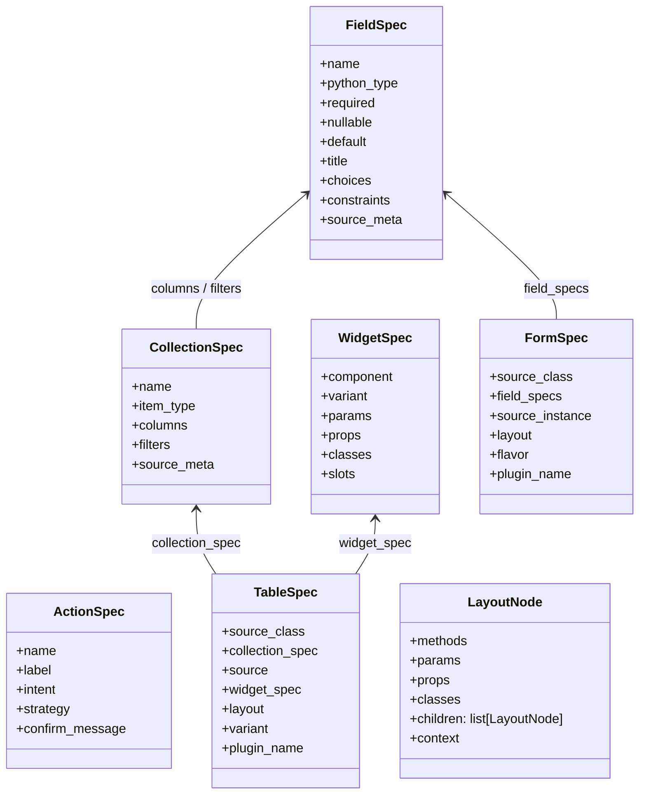
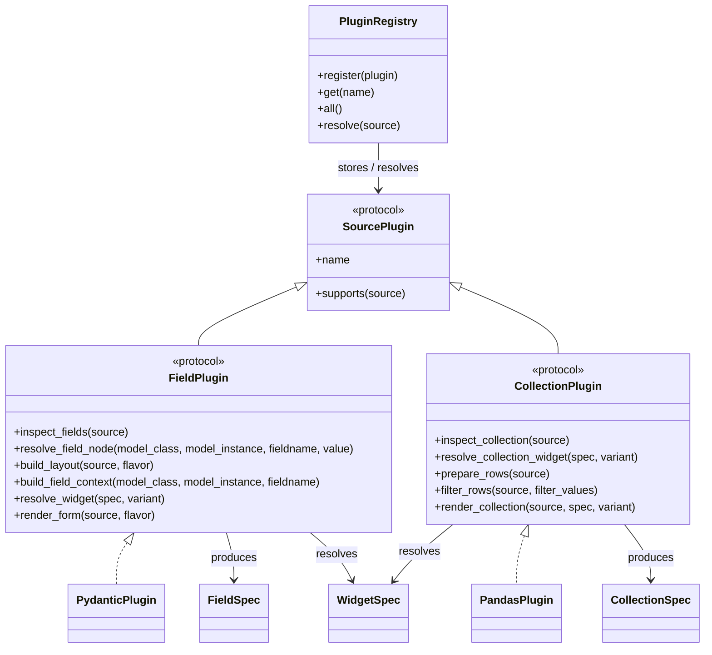
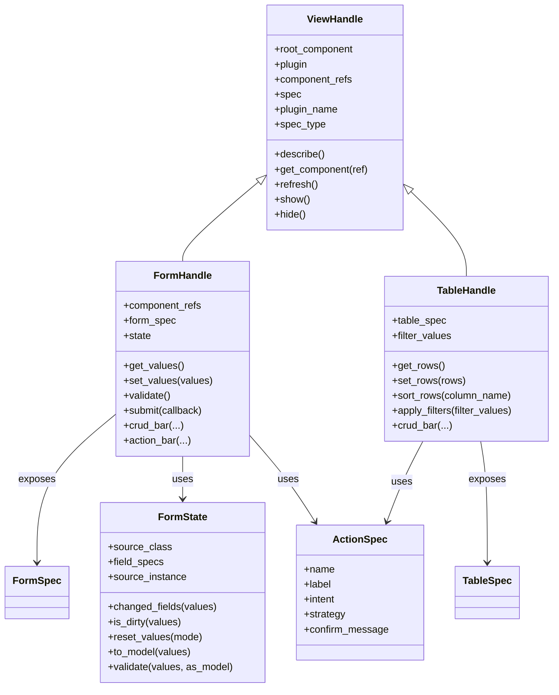

# Architecture

[Home](../README.md)

[Previous: Plugin Development](plugin.md) | [Next: Public API](public-api.md)

This document describes the current architecture of `nicegui-builder` in a way that is meant to be readable by humans first.

The main idea is simple:

- plugins understand sources
- specs normalize what was discovered
- the builder renders NiceGUI components
- handles provide runtime interaction

## Mental Model

`nicegui-builder` is a plugin-first NiceGUI generation library.

The core should not directly understand `pydantic`, `pandas`, or future sources such as `dataclasses` or `sqlmodel`.
Instead, plugins inspect those sources and convert them into stable intermediate models that the rest of the library can use.

## Global Flow

This is the shortest useful way to understand the project:

Examples:

- `Pydantic model -> PydanticPlugin -> FieldSpec/FormSpec -> form(...) -> FormHandle`
- `Pandas DataFrame -> PandasPlugin -> CollectionSpec/TableSpec -> table(...) -> TableHandle`

## Layers

### 1. Source Layer

This is the user-provided input.

Examples:

- a `pydantic.BaseModel` subclass
- a `pydantic` instance
- a `pandas.DataFrame`
- later, a `dataclass`, `json schema`, or `sqlmodel` type

### 2. Plugin Layer

Plugins are responsible for understanding source-specific structure.

Responsibilities:

- determine whether a source is supported
- inspect the source
- produce normalized specs
- choose widgets or default layouts
- optionally render richer variants directly

### 3. Spec Layer

Specs are the internal language shared by the rest of the system.

They capture what was discovered about the source without tying that information directly to a specific framework or view instance.

### 4. Rendering Layer

Rendering is handled either by:

- the generic declarative builder
- or a plugin-specific rich renderer for special variants

### 5. Runtime Layer

Handles provide runtime interaction after rendering.

Examples:

- read or update current form values
- validate and submit a form
- sort/filter/export a table
- expose the spec and the root component
- expose component refs for later component lookup

## View 1: Core Specs

This view shows the intermediate models that structure the library.

### Why these matter

- `FieldSpec` and `CollectionSpec` describe the source
- `WidgetSpec` describes UI intent
- `FormSpec` and `TableSpec` describe a concrete view definition
- `ActionSpec` describes reusable user actions

## View 2: Plugins

This view shows how plugins fit into the architecture.

### Important idea

The registry resolves the right plugin for a source.
After that, the rest of the pipeline works through an explicit contract for that plugin family rather than repeating capability checks at every call site.

## View 3: Runtime Handles

This view shows the objects returned to users after rendering.

### Important idea

The handles are not just raw NiceGUI components.
They are lightweight view-oriented facades:

- `ViewHandle` gives a common base
- `FormHandle` adds form state, validation, submit, and live helpers
- `TableHandle` adds rows, filters, selection, export, and table actions
- handles can also expose `component_refs` for named runtime lookup

## Builder Role

The generic builder is intentionally not shown as a large class diagram because its role is operational rather than conceptual.

What matters architecturally is this:

- it renders normalized declarative nodes
- it resolves context values
- it supports plugin-assisted node expansion such as `field__name`
- it keeps a small explicit runtime context for refs and root-component tracking
- it collects named refs into `component_refs`

In other words, the builder is the bridge between normalized layout decisions and actual NiceGUI components.

## Current Built-In Plugins

### `pydantic`

Main role:

- forms
- field inspection
- automatic flavors
- widget resolution from type and metadata
- model-aware validation and reconstruction

Examples of notable behavior:

- automatic form layouts
- widget mapping from `pydantic-nicegui.yml`
- split `datetime` handling through the shared `datetime_input` component
- automatic field refs in `component_refs`, including composite logical refs for split `datetime`

### `pandas`

Main role:

- tables
- column inspection
- filter-oriented metadata
- filtered table variant

Examples of notable behavior:

- sortable table defaults
- pagination and selection support
- richer filtering workflow with operator-aware filter building and an active filter list
- canonical filter clauses normalized before filtering

## Design Principles

- Keep the core source-agnostic.
- Keep plugins self-contained.
- Prefer specs over ad hoc dictionaries.
- Use YAML for declarative defaults and Python for heuristics.
- Separate pure state from UI-bound behavior when possible.
- Keep the top-level API stable even while internals evolve.

## Patchy Integrations

Some conveniences in the project are intentionally implemented as thin patches rather than as first-class upstream extension points.

Current examples:

- `nicegui_builder` attaches `builder`, `datetime_input`, `form_builder`, and `table_builder` to NiceGUI's runtime `ui` object
- the workspace can provide editor completion for those added methods through local partial stubs in [`typings/nicegui/ui.pyi`](../typings/nicegui/ui.pyi)
- those stubs are generated from NiceGUI's own `ui` module by [`scripts/generate_nicegui_ui_stub.py`](../scripts/generate_nicegui_ui_stub.py)

These integrations are useful and deliberate, but they should still be understood as package-owned glue:

- runtime behavior is provided by `nicegui-builder`
- editor behavior depends on the local typing setup and generated stub
- neither mechanism implies that NiceGUI itself natively declares those methods

## Practical Reading Order

If someone is new to the project, the best order is:

1. read the global flow
2. read the Core Specs view
3. read the Plugins view
4. read the Runtime Handles view
5. only then look at implementation files

## Related Documents

- [`README.md`](../README.md) for using the library
- [`docs/plugin.md`](plugin.md) for writing plugins
- [`docs/public-api.md`](public-api.md) for the stable API surface
- [`docs/examples.md`](examples.md) for the planned example set
